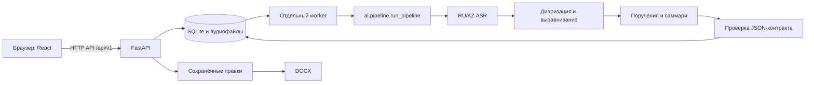

# Архитектура Хаттамы

## Поток обработки

## Компоненты

| Каталог | Ответственность |
|---|---|
| `frontend/` | React/TypeScript: загрузка, очередь, проверка результата, экспорт |
| `backend/` | FastAPI, ограничения загрузки, SQLite, очередь, сохранение правок и DOCX |
| `ai/` | Декодирование, распознавание, говорящие, извлечение поручений, проверка ссылок |
| `contracts/` | JSON Schema входа и результата; синтетические примеры |
| `models/` | Метаданные, лицензии и каталог внешних весов |
| `scripts/` | Установка, проверка моделей, запуск и остановка процессов |
| `deploy/` | Точка входа контейнера и проверка HTTP-состояния |

FastAPI раздаёт собранный `frontend/dist`: UI и API имеют один origin. API не загружает тяжёлые модели. `scripts/manage.py` запускает API и worker отдельными процессами, останавливает оба при выходе или сбое одного. В Docker внешний restart policy перезапускает всё приложение.

## Размещение на NVIDIA Brev

Brev предоставляет виртуальную машину. На ней Docker запускает приложение; браузер получает доступ к его обычному HTTP API через SSH-туннель или авторизованный Secure Link. Control-plane API Brev управляет машинами и не используется как ASR/LLM endpoint.

Контейнер слушает `0.0.0.0:8000`, Docker по умолчанию публикует `127.0.0.1:8000`. SQLite и аудио находятся в volume `/data`; модели смонтированы в `/models` read-only. Образ не содержит ключей, пользовательских данных или весов. Процесс работает непривилегированным пользователем.

Профиль `brev`: Linux x86_64 / Python 3.12, PyTorch CPU, исходный TorchScript RU/KZ CTC, Sherpa ONNX для диаризации и Qwen3-4B-Instruct-2507 affine 4-bit. `ai/mlx_torch.py` выполняет исходный компактный MLX checkpoint в PyTorch с ограничением размера распаковываемого блока. Apple MLX и NVIDIA GPU не обязательны. Потребление памяти и время полного сценария на целевой VM проверяются отдельно.

Каждый этап AI выполняется в отдельном дочернем процессе; завершение освобождает его память. Контекст модели и длительность записи ограничены настройками. Перед запуском реального профиля проверяются файлы моделей и зависимости. `doctor` дополнительно проверяет SHA-256. Неизвестный или отсутствующий формат вызывает ошибку, а не скачивание или смену модели во время обработки.

## Очередь и сохранность

Задание захватывается короткой транзакцией SQLite; обработка идёт вне транзакции. Блокировка worker связана с файлом базы, дополнительная блокировка AI — с рабочим каталогом. Один worker обслуживает одну локальную базу; сетевой файловый ресурс для SQLite не предусмотрен.

После аварийного завершения следующий worker переводит незавершённые задания в `failed`. Повтор — явное действие пользователя. Активное задание нельзя удалить. Исходный результат ИИ сохраняется неизменяемым. Исправления проверяются по JSON Schema и сохраняются с транзакционным сравнением `expected_revision`. DOCX формируется из одной сохранённой версии.

## Контракты и качество

`contracts/input.schema.json` и `contracts/result.schema.json` задают форму данных. Смена окружения с ноутбука на Brev не меняет эти схемы. HTTP-оболочка описана в `docs/API_CONTRACT.md`, синхронный вызов AI и стадии — в `docs/ML_CONTRACT.md`.

Каждое поручение связано с реальными идентификаторами исходных реплик. Исполнитель не выводится из личности говорящего автоматически. Неопределённые имена и сроки остаются `null`. Относительные сроки вычисляются от указанной даты совещания и часового пояса только по поддержанным правилам.

Режим `fixture` хранится вместе с заданием и виден в UI/DOCX. Он никогда не становится резервным ответом при ошибке реального AI. Тестовые примеры и метрики не подменяют измерение качества на настоящих совещаниях.

## Граница данных

При работе через Brev аудио, транскрипты и результаты передаются на выбранную VM. В текущем профиле дальнейшей отправки в NVIDIA Build или другие inference API нет: дочерние процессы моделей блокируют сетевые запросы. Установка зависимостей и загрузка весов выполняются отдельно с сетью.

В приложении пока нет собственной аутентификации. Для команды нужен защищённый доступ Brev; прямой открытый порт не заменяет вход. Резервное копирование должно включать согласованный снимок базы и аудиокаталога. `/health` означает доступность API, а не измеренное качество или производительность моделей.
