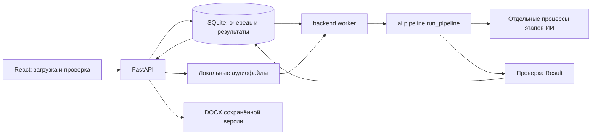

# Архитектура Хаттамы

Одно локальное приложение: React/TypeScript, FastAPI, SQLite и отдельный Python-worker. Модели работают на машине пользователя. API не загружает тяжёлые модели и остаётся доступным во время обработки.

## Границы и контракты

| Компонент | Ответственность |
|---|---|
| `frontend/` | Формы, очередь и статусы, сопоставление говорящих, правки саммари и поручений, переход к источникам |
| `backend/app.py` | HTTP API, ограничение загрузки, проверка метаданных и аудио, раздача `frontend/dist` |
| `backend/store.py` | Короткие транзакции SQLite, захват задания, исходный результат и сохранённая редакция |
| `backend/worker.py` | Один потребитель очереди, восстановление после остановки, запуск конвейера |
| `ai/` | Декодирование, ASR, диаризация, совмещение таймкодов, извлечение и проверка результата |
| `backend/export.py` | Формирование DOCX из одной сохранённой версии |

Внутренний интерфейс — `ai.pipeline.run_pipeline(input_data, on_progress=None)`. Вызов синхронный; callback получает `{"stage": "..."}`. Форматы задают [input.schema.json](contracts/input.schema.json) и [result.schema.json](contracts/result.schema.json); [API.md](contracts/API.md) описывает HTTP-оболочку. Синтетические примеры находятся в `contracts/examples/`.

Вход содержит `meeting_id`, локальный `audio_path`, фактическое время с UTC-смещением, IANA-зону и участников. Backend сам создаёт идентификатор и безопасное имя загруженного файла. Результат содержит участников, реплики с таймкодами, поручения с `source_segment_ids`, саммари и предупреждения. Отсутствующий исполнитель или срок остаётся `null`, поручение требует проверки. Метка голоса не устанавливает личность человека.

## Обработка и процессы

1. API проверяет метаданные, размер потока и декодирование файла, затем сохраняет задание как `queued`.
2. Worker захватывает старейшее задание транзакцией `BEGIN IMMEDIATE` и переводит его в `processing`. Модели работают вне транзакции БД.
3. Конвейер последовательно запускает `preparing_audio`, `transcribing`, `diarizing`, совмещает слова и говорящих (`aligning`), запускает `extracting_tasks`, сообщает `summarizing` и валидирует результат (`validating`). Саммари формируется вместе с поручениями.
4. Каждый тяжёлый этап выполняется отдельным процессом `python -m ai.worker`. После завершения память процесса освобождается. По умолчанию таймаут этапа — 3600 секунд (`AI_STAGE_TIMEOUT`).
5. Успешный результат сохраняется как `done`, первая редакция — 1. При ошибке задание становится `failed` с безопасным сообщением. Автоматического переключения моделей, облачного API или фикстуры нет.

Один worker обслуживает одну БД: файловая блокировка на Unix, именованный mutex на Windows. Конвейер дополнительно блокирует свой `AI_STATE_DIR`. При старте worker после получения блокировки переводит оставшиеся `processing` в `failed`; пользователь может повторить их.

`scripts/manage.py run` запускает API и worker и останавливает оба при выходе или завершении одного из процессов. На Windows Job Object связывает жизнь worker и его дочерних этапов. Интерфейс опрашивает фактический статус и не показывает искусственные проценты готовности.

## Хранение и исправления

По умолчанию `DATA_DIR=.local/app`: `meetings.sqlite3`, каталог `audio/`, приватный `ai-private/`. SQLite работает в WAL-режиме. Временные файлы вызова конвейера удаляются при штатном выходе из него; после аварийного завершения процесса остатки могут потребовать локальной очистки. `data/` содержит исходные материалы хакатона и не является рабочим хранилищем приложения.

`original_json` хранит неизменяемый машинный результат. `review_json` хранит последнюю сохранённую редакцию. PUT review заменяет только участников, поручения и саммари; реплики и исходные метаданные не редактируются. `expected_revision` проверяется в одной транзакции с записью: конкурирующая правка получает 409. Номер редакции не означает наличие полной истории всех сохранений.

Валидация проверяет JSON Schema, уникальность идентификаторов, ссылки на участников и источники, реальные календарные даты, порядок и корректность таймкодов. Наличие источника не доказывает смысловую точность поручения — её проверяет человек. DOCX содержит последнюю сохранённую редакцию, участников, поручения, саммари, транскрипт и предупреждения; интерфейс требует сохранить изменения перед экспортом.

Удаление задания в `processing` запрещено. Для остальных состояний backend удаляет связанное аудио и запись; ошибка удаления файла не выдаётся за успех. Retry разрешён только для `failed`, поэтому случайный повтор не уничтожает успешный результат с правками.

## Модели и офлайн-граница

Windows-профиль использует исходные mixed-STT CTC, Sherpa ONNX и Qwen3-4B-Instruct-2507 MLX 4-bit. `ai/mlx_torch.py` исполняет тот же квантованный checkpoint через PyTorch; альтернативные веса автоматически не скачиваются. Устройство выбирается до обработки, контекст Windows ограничен 2048 токенами, ответ — 512. Mac-профиль использует исходный MLX runtime на Apple Silicon. Linux `cuda` требует отдельной настройки локальных моделей и не считается проверенным Windows-тестом.

`scripts/prepare_repo_models.py` собирает части прямо в `models/` по `models/repository-models.lock.json`, проверяя размеры и SHA-256. Исходные идентификаторы и хеши также закреплены в `ai/mac-models.lock.json`; лицензии — в `models/`. Загрузка зависимостей и доставка весов отделены от обработки записей.

Этапы ИИ устанавливают offline-флаги библиотек и Python audit-hook, запрещающий DNS, исходящие TCP/UDP-сокеты. FFmpeg ограничен локальными протоколами `file,pipe`; входящие форматы проверяются API. Эти меры не заменяют сетевую изоляцию ОС. API по умолчанию слушает `127.0.0.1`; публичная аутентификация, шифрование локального хранилища и распределённая очередь не реализованы.

## Проверенная граница

Тесты контрактов, очереди, исправлений, процессов и интерфейса используют синтетические данные. Отдельная проверка на настоящих моделях обработала 20.8 секунды синтетической русской речи за 197 секунд на RTX 3050 Laptop 4 ГБ: 6 реплик, 2 говорящих, 2 поручения. Зафиксированы ошибки относительного срока и саммари, поэтому результат остаётся черновиком. Измерения памяти, состав машины и шаги HTTP/браузер/DOCX/перезапуск — в [техническом отчёте](ai/evidence/windows-original-models.json).

Этот запуск не измеряет качество казахской или смешанной речи, длинных записей и полного CPU-профиля. Независимые языковые WER/DER и полнота поручений для Windows-профиля ещё не определены. DOCX проверен по структуре и тексту; визуальная вёрстка в указанном запуске не проверялась. Инструкции воспроизводимости и сценарий приёмки — в [README](README.md).
