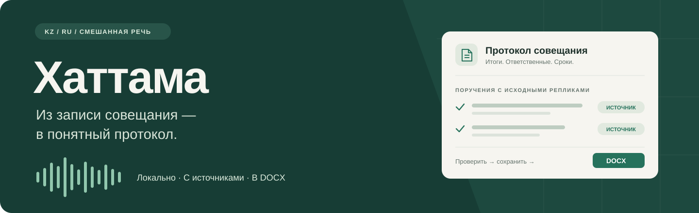

# Хаттама

**Помощник для подготовки протоколов совещаний на русском, казахском и смешанном языке.**

Загрузите аудио, получите расшифровку с говорящими, проверьте поручения и сохраните протокол в DOCX. У каждого поручения есть исходные реплики, а правки человека сохраняются отдельно от результата модели.

**[Запуск на Brev](#запуск-на-brev) · [Модели](#модели) · [Как пользоваться](#работа-с-протоколом) · [Архитектура](ARCHITECTURE.md) · [Разработка](#разработка-и-проверки)**

> **Модели уже в репозитории.** Все 3,08 ГБ весов находятся в [`models/`](#модели) и скачиваются вместе с проектом. Сборка частей выполняется локально с проверкой SHA-256. Git LFS, GitHub CLI и доступ к исходной ссылке Hugging Face для этого не нужны.

## Что получаете

| Возможность | Результат |
|---|---|
| Распознавание речи | Расшифровка с временными метками; поддерживается русская, казахская и смешанная речь |
| Разделение по голосам | Метки говорящих, которые можно сопоставить с участниками |
| Поручения с доказательствами | Задача, исполнитель, срок и ссылки на исходные реплики |
| Проверка человеком | Редактирование саммари, участников и поручений с сохранением исходного результата |
| История совещаний | Записи и сохранённые правки остаются после перезапуска |
| Экспорт | DOCX из последней сохранённой версии протокола |

Аудио и текст обрабатываются на машине, где запущено приложение. Ошибка модели завершает задание с ошибкой; автоматического перехода на облачный сервис или тестовый результат нет.

Полное приложение находится в корне: `frontend/`, `backend/`, `ai/`. Основной серверный профиль — **NVIDIA Brev, Linux x86_64, Python 3.12**. Браузер работает с нашим HTTP API; модели выполняются на машине Brev. Brev предоставляет вычислительную машину, а не готовый API распознавания. Ключ NVIDIA Build/NIM для этого варианта не нужен.

## Запуск на Brev

Машина должна перейти в состояние **Running**. Профиль `brev` рассчитан на CPU: собственная видеокарта и CUDA не обязательны. Для машины с 4 CPU / 16 ГиБ не заявлены ни скорость реального времени, ни проверенная производительность: её нужно измерить на записи после развёртывания.

Установите [Brev CLI](https://docs.nvidia.com/brev/cli) на своём компьютере, выполните вход и подключитесь к **хосту** существующей машины:

```bash
brev login
brev refresh
brev shell testhackalem --host
```

На машине нужны Docker с Compose и копия этого проекта. Launchable NemoClaw сам по себе не устанавливает Хаттаму. Если проект ещё не скопирован, используйте Git с доступом к репозиторию или передачу файлов через Brev. Все следующие команды выполняются в корне проекта **на сервере**:

```bash
cp .env.example .env
python3 scripts/prepare_repo_models.py
docker compose up -d --build
docker compose logs -f app
```

Проверка доступности API на сервере:

```bash
curl --fail http://127.0.0.1:8000/health
```

Ответ `{"status":"ok"}` подтверждает работу HTTP API. Проверка настоящих моделей — успешная обработка записи, а не этот endpoint.

Откройте приложение через SSH-туннель с локального компьютера:

```bash
brev port-forward testhackalem --host --port 8000:8000
```

Адрес в браузере: **http://127.0.0.1:8000**. Для Brev Secure Link используйте destination port **8000** и доступ с авторизацией. Настроенный в панели порт 80 не совпадает с портом приложения. По умолчанию Compose публикует API только на loopback хоста. Если настройка вашего Secure Link требует внешний bind, задайте `BREV_BIND_ADDRESS=0.0.0.0` и ограничьте прямой доступ средствами Brev/файрвола: в самом приложении пока нет пользователей и входа. [Подключение и туннели Brev](https://docs.nvidia.com/brev/cli/connectivity).

## Модели

Веса уже находятся в `models/` репозитория; Git LFS и отдельный ключ NVIDIA не нужны. После `git clone` / `git pull` соберите крупные файлы из частей и проверьте SHA-256 без сети:

```bash
python3 scripts/prepare_repo_models.py
# На Windows: py scripts/prepare_repo_models.py
```

Для частей, истории Git и собранных весов оставьте не менее 12 ГБ свободного места, плюс место для Docker и записей. Профили `mac`, `windows` и `brev` при прямом запуске собирают корневой `models/` автоматически. Docker использует готовую папку read-only, поэтому сборка выполняется на хосте **до** старта контейнера.

После сборки общий комплект содержит:

```text
models/
├── asr/model.pt
├── asr/tokens.lst
├── diarization/segmentation.onnx
├── diarization/embedding.onnx
└── llm/                        # полный Qwen3-4B-Instruct-2507, affine 4-bit
```

Уже скачанный комплект можно скопировать на сервер и указать `MEETING_MODEL_DIR=/путь/на/сервере/models` в `.env`. Путь с ноутбука не становится доступным на Brev автоматически.

Резервный вариант — скачать тот же комплект из Releases. Только для этого способа нужен GitHub CLI с доступом к репозиторию:

```bash
gh auth login
python3 scripts/download_models.py --directory models
```

Загрузчик проверяет SHA-256, возобновляет загрузку проверенными частями и не требует доступности исходного Hugging Face репозитория. Комплект — около 3,08 ГБ; оставьте дополнительное место для частей, образа Docker и записей.

На Brev исходный MLX-файл читает ограниченный по памяти адаптер PyTorch; библиотека Apple MLX не используется. Сами веса не переобучаются и не изменяются. Поддерживается только зафиксированный формат. Проверить комплект в подготовленном контейнере:

```bash
docker compose run --rm --entrypoint python app -m ai.model_check --models /models --device cpu --verify-hashes
```

Источники, лицензии и атрибуция: [models/NOTICE.md](models/NOTICE.md). Контрольные суммы: `ai/mac-models.lock.json`, `models/source-models.lock.json`, `models/github-release.lock.json`, `models/repository-models.lock.json`. Модели и пользовательские записи не включаются в Docker-образ.

## Данные и конфигурация

Compose сохраняет SQLite, загруженные аудио и исходные/исправленные результаты в Docker volume `hattama_app-data`. Остановка и обновление контейнера сохраняют этот том. Модели подключаются отдельно в `/models` только для чтения.

```bash
docker compose stop
docker compose up -d
```

`docker compose down -v` удаляет данные: не используйте его для обычного перезапуска. Резервную копию SQLite и аудио делайте вместе при остановленном приложении.

| Переменная | По умолчанию | Назначение |
|---|---|---|
| `APP_PROFILE` | `brev` | Контейнер: реальные серверные модели; `fixture` — синтетический тест |
| `MEETING_MODEL_DIR` | `./models` | Каталог моделей на Docker-хосте |
| `BREV_HOST_PORT` | `8000` | Порт приложения на хосте |
| `BREV_BIND_ADDRESS` | `127.0.0.1` | Адрес публикации Docker-порта |
| `MAX_UPLOAD_BYTES` | `104857600` | Максимальный размер аудио, 100 МиБ |
| `AI_CONTEXT_TOKENS` | `2048` | Контекст для ограниченного адаптера Qwen |
| `AI_MAX_NEW_TOKENS` | `512` | Максимальный ответ за один вызов модели |

Вне контейнера доступны `BACKEND_HOST` (loopback по умолчанию), `BACKEND_PORT`, `DATA_DIR`, `DATABASE_PATH`, `AI_STATE_DIR`, `AI_THREADS`. `scripts/manage.py` читает `.env` без выполнения shell-кода; переменные процесса имеют приоритет. В Compose внутренние пути и порт заданы в `docker-compose.yml`.

## Работа с протоколом

1. Загрузите WAV, MP3, M4A или FLAC; укажите дату со смещением UTC, часовой пояс IANA и известных участников.
2. Дождитесь обработки. Интерфейс показывает этапы, без выдуманного процента готовности.
3. Сопоставьте голоса с участниками, проверьте расшифровку, поручения и сроки по исходным репликам.
4. Сохраните правки и скачайте DOCX. Исходный результат ИИ хранится отдельно; конфликт параллельных правок определяется номером версии.

У неизвестного исполнителя/срока остаётся `null`; поручение требует проверки. Ошибку обработки можно повторить вручную. Автоматического переключения на тестовые ответы нет.

## Разработка и проверки

Для запуска без Docker нужны Python 3.12 и Node.js 22.13+:

```bash
# Синтетический сценарий: без моделей и без оценки качества распознавания.
python3.12 scripts/manage.py setup --profile fixture
python3.12 scripts/manage.py run --profile fixture
```

Реальные профили: `brev` (Linux x86_64 CPU), `windows` (CPU или явно выбранный CUDA), `mac` (Apple Silicon / MLX), `cuda` (отдельно подготовленные GPU-модели и `AI_*` настройки). Профили не переключаются автоматически при ошибке.

```bash
# На Linux x86_64:
make setup PROFILE=brev
make up PROFILE=brev MODELS="$PWD/models"
# Проверить зависимости и исходные веса:
.venv/bin/python scripts/manage.py doctor --profile brev --models "$PWD/models"
# Тесты Python, тесты frontend и production-сборка:
make verify
```

Тестовый контейнер использует ту же сборку, но не запускает модели:

```bash
APP_PROFILE=fixture docker compose up -d --build
```

### Локальная разработка: Mac и Windows

Mac Apple Silicon использует профиль MLX:

```bash
make setup PROFILE=mac
make up PROFILE=mac
```

На Windows установка и запуск выполняются из PowerShell без `make`:

```powershell
py -3.14 scripts/manage.py setup --profile windows --python .venv/Scripts/python.exe
.\start-windows.cmd
```

Явный CPU: `.\start-windows.cmd -Device cpu`. Для совместимой NVIDIA-карты можно установить CUDA-сборку в то же окружение и проверить её:

```powershell
.\.venv\Scripts\python.exe -m pip install torch==2.14.0+cu130 --index-url https://download.pytorch.org/whl/cu130
.\.venv\Scripts\python.exe scripts/manage.py doctor --profile windows --device cuda
.\start-windows.cmd -Device cuda
```

Windows использует исходный комплект и адаптер PyTorch, Mac — MLX. Автосборка весов работает в корневом `models/`; отдельного окружения прототипа нет. Для Mac Intel профиль `mac` не подходит. При прямом запуске Ctrl+C останавливает API и worker вместе.

Схемы данных находятся в `contracts/`; HTTP-маршруты — в [docs/API_CONTRACT.md](docs/API_CONTRACT.md), граница AI — в [docs/ML_CONTRACT.md](docs/ML_CONTRACT.md), устройство приложения — в [ARCHITECTURE.md](ARCHITECTURE.md).

## Ограничения

Результат — черновик для проверки человеком. Тестовые данные не подтверждают качество RU/KZ, диаризации или поручений. Один worker обслуживает одну базу; горизонтальное масштабирование и многопользовательская авторизация не реализованы. При развёртывании на Brev аудио и текст находятся на удалённом сервере. Сам AI-процесс выполняет модели без внешнего API и без облачного fallback.
