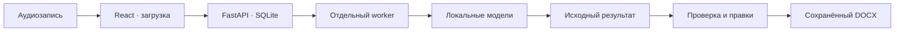

# Хаттама

**Локальный помощник для подготовки протоколов совещаний на русском, казахском и смешанном языке.**

Загрузите аудио, получите расшифровку с говорящими, проверьте поручения и сохраните протокол в DOCX. У каждого поручения есть исходные реплики, а правки человека сохраняются отдельно от результата модели.

**[Быстрый запуск](#быстрый-запуск) · [Веса моделей](#веса-моделей) · [Как пользоваться](#как-пользоваться) · [Архитектура](#архитектура) · [Документация](#документация)**

> **Модели уже в репозитории.** Все 3,08 ГБ весов находятся в [`models/`](models/) и скачиваются вместе с проектом. Сборка частей выполняется локально с проверкой SHA-256. Git LFS, GitHub CLI и доступ к исходной ссылке Hugging Face для этого не нужны.

## Что получаете

| Возможность | Результат |
|---|---|
| Распознавание речи | Расшифровка с временными метками; поддерживается русская, казахская и смешанная речь |
| Разделение по голосам | Метки говорящих, которые можно сопоставить с участниками |
| Поручения с доказательствами | Задача, исполнитель, срок и ссылки на исходные реплики |
| Проверка человеком | Редактирование саммари, участников и поручений с сохранением исходного результата |
| История совещаний | Записи и сохранённые правки остаются после перезапуска |
| Экспорт | DOCX из последней сохранённой версии протокола |

Аудио и текст обрабатываются локально. Ошибка модели завершает задание с ошибкой; автоматического перехода на облачный сервис или тестовый результат нет.

## Быстрый запуск

### 1. Подготовьте окружение

| Что нужно | Требование |
|---|---|
| Git | Доступ к этому закрытому репозиторию |
| Python | **3.12** для Mac/Linux; Windows-профиль проверен на **3.14.6** |
| Node.js | **22.13+**, вместе с npm |
| Диск | **12 ГБ для весов, частей и истории Git**, плюс место для зависимостей |
| Компьютер | Mac Apple Silicon или Windows; отдельный Linux/CUDA-профиль описан ниже |

### 2. Скачайте проект

```bash
git clone --depth 1 https://github.com/BAITC-Hacks/hack-37d3e924-bbc.git
cd hack-37d3e924-bbc
```

Уже есть копия проекта? Обновите её через `git pull`. Все команды ниже выполняются **из корня репозитория**.

### 3. Выберите свою систему

#### Windows · PowerShell

Установка создаёт единое окружение `.venv` в корне проекта и собирает интерфейс и веса:

```powershell
.\setup-windows.cmd
.\start-windows.cmd
```

Запуск собирает модели из `models/`, проверяет зависимости и выбирает доступную PyTorch CUDA либо CPU. Выбранное устройство печатается в терминале. Явный запуск на CPU: `.\start-windows.cmd -Device cpu`.

<details>
<summary><strong>Windows с NVIDIA — установка проверенной CUDA-сборки</strong></summary>

При совместимом NVIDIA-драйвере можно явно выбрать CUDA при установке и запуске:

```powershell
.\setup-windows.cmd -Device cuda
.\.venv\Scripts\python.exe scripts/manage.py doctor --profile windows --device cuda
.\start-windows.cmd -Device cuda
```

Проверены Python **3.14.6** и PyTorch **2.14.0+cu130**. `doctor` проверяет файлы, контрольные суммы, зависимости и выбранное устройство. Скрипты используют корневую `.venv`; окружение старого прототипа больше не требуется. Полный конвейер на CPU отдельно не замерялся.

</details>

#### Mac · Apple Silicon

```bash
make setup PROFILE=mac
make up PROFILE=mac
```

Используется Python 3.12 и MLX. При запуске веса из `models/` собираются и проверяются автоматически. Для Intel Mac этот профиль не предназначен.

**Откройте [http://127.0.0.1:8000](http://127.0.0.1:8000).** Терминал оставьте открытым; **Ctrl+C** останавливает приложение и worker вместе.

<details>
<summary><strong>Посмотреть интерфейс без запуска моделей</strong></summary>

Windows:

```powershell
py -3.14 scripts/manage.py setup --profile fixture
py -3.14 scripts/manage.py run --profile fixture
```

Mac/Linux с Python 3.12:

```bash
make setup PROFILE=fixture
make up PROFILE=fixture
```

Загрузите корректное аудио и укажите дату записи. Приложение проверит декодирование и вернёт **явно помеченный синтетический результат**. Этот режим позволяет проверить интерфейс, сохранение и экспорт; он не измеряет качество распознавания и не включается автоматически при сбое настоящего AI.

</details>

<details>
<summary><strong>Linux с NVIDIA — отдельный профиль CUDA</strong></summary>

```bash
make setup PROFILE=cuda
# Подготовьте локальные веса и задайте AI_* в .env по .env.example.
make up PROFILE=cuda
```

Этот профиль требует отдельной настройки локальных моделей и библиотек. Его зависимости закреплены, но сквозной запуск на Linux GPU не проверен. Работа Windows-профиля не подтверждает готовность Linux. См. [архитектуру](ARCHITECTURE.md) и [пример настроек](.env.example).

</details>

## Как пользоваться

1. **Добавьте запись.** Поддерживаются WAV, MP3, M4A и FLAC; стандартный предел загрузки — 100 МиБ.
2. **Укажите контекст.** Введите реальную дату и время совещания, часовой пояс и известных участников. Это нужно, в частности, для относительных сроков вроде «к завтрашнему дню».
3. **Дождитесь обработки.** Интерфейс показывает реальные этапы: подготовка, распознавание, разделение по голосам и извлечение результатов.
4. **Проверьте протокол.** Сопоставьте голоса с участниками, проверьте саммари, исполнителей и сроки по исходным репликам. Неизвестные значения требуют уточнения.
5. **Сохраните правки и скачайте DOCX.** Экспорт использует сохранённую версию. Исходный результат модели остаётся доступным отдельно.

Для ручного поручения нужны исходные реплики. Несохранённые правки блокируют экспорт, а одновременные изменения защищены номером версии. Неудачную обработку можно повторить из интерфейса. Хранятся машинный оригинал и последняя редакция; полной истории редакций пока нет. Одновременно обрабатывается одна запись; удаление работающего задания заблокировано.

## Веса моделей

**Одна и та же исходная модель используется на Mac и Windows; различается движок выполнения.**

| Этап | Модель | Файлы |
|---|---|---|
| Речь → текст | Kazakh/Russian mixed-STT, TorchScript CTC | [`models/asr/`](models/asr/) |
| Разделение по голосам | pyannote segmentation ONNX + 3D-Speaker embedding | [`models/diarization/`](models/diarization/) |
| Поручения и саммари | Qwen3-4B-Instruct-2507, MLX 4-bit | [`models/llm/`](models/llm/) |

Большие файлы разбиты на части до 48 МиБ. На Mac их использует MLX; на Windows — адаптер `mlx_torch`, который читает исходные упакованные веса через PyTorch.

Ручная сборка и проверка, если не запускаете приложение сразу:

```bash
python3 scripts/prepare_repo_models.py
python3 scripts/prepare_repo_models.py --verify-only
```

На Windows используйте `py` вместо `python3`. Сборка работает **без сети**, проверяет каждую часть и готовый файл и пропускает уже собранные исправные модели. Исходные части остаются в репозитории.

[Закреплённые размеры и SHA-256](models/repository-models.lock.json) · [Происхождение и атрибуция](models/NOTICE.md) · [Лицензии](models/licenses/)

## Архитектура



API принимает запись, сохраняет её и ставит задание в очередь. Отдельный worker вызывает `ai.pipeline.run_pipeline`; тяжёлые модели не загружаются в процесс API. Исходный результат и исправленная версия хранятся отдельно, а DOCX формируется из одной сохранённой версии.

```text
frontend/                 React + TypeScript: загрузка, проверка, экспорт
backend/                  FastAPI, SQLite, очередь, worker и DOCX
ai/                       Распознавание, голоса, поручения и саммари
models/                   Веса, части, контрольные суммы и лицензии
contracts/                JSON-схемы входа и результата
scripts/                  Установка, запуск, сборка весов и проверки
data/                     Исходные материалы хакатона
.local/                   Локальные БД, аудио и отчёты; исключено из Git
.venv/                    Единое Python-окружение; исключено из Git
```

Основное приложение работает из корня на порту **8000**. Запуск не зависит от `prototypes/`. На машине, где выполнен перенос, старый Streamlit с его локальными файлами сохранён в `.local/legacy-prototype`; этот архив не входит в Git. [Архитектура подробнее](ARCHITECTURE.md).

## Что проверено

В репозитории зафиксирован сквозной Windows-прогон на **RTX 3050 Laptop 4 ГБ, 16 ГБ RAM** с исходными моделями. Вход — **синтетическая русская запись с двумя голосами**.

| Параметр | Зафиксированный результат |
|---|---:|
| Длительность записи | 20,8 с |
| Время полного конвейера | 197 с |
| Результат | 6 реплик, 2 метки говорящих, 2 поручения |
| Пик выделенной CUDA-памяти PyTorch | 2,443 GiB |

Проверены также загрузка через приложение, исправление протокола, сохранение правок после перезапуска и экспорт DOCX. Это результат одного прогона, **не оценка точности на реальных совещаниях**. Модель пропустила относительный срок и ошиблась в саммари — проверка человеком остаётся обязательной.

[Машиночитаемые результаты](ai/evidence/windows-original-models.json) · [Границы проверки](ARCHITECTURE.md#проверенная-граница)

После переноса приложения в корень повторно проверены исходные модели: 6 реплик и 2 поручения; сохранение правок через браузер и DOCX с казахскими буквами. Прошёл **171 тест**: 108 AI, 18 backend, 37 инструментов и 8 frontend; также прошли lint, TypeScript-проверка и production build. Число тестов относится к состоянию после переноса и интеграции запуска моделей.

## Проверки проекта

После установки зависимостей:

```bash
make verify
```

На Windows:

```powershell
.\.venv\Scripts\python.exe scripts/manage.py verify
```

Команда запускает тесты backend, AI и скриптов, затем тесты интерфейса, сборку TypeScript/Vite и проверку компиляции Python. Тестовые фикстуры и маленькие искусственные модели проверяют логику, а не качество распознавания.

Проверка выданных материалов хакатона без передачи содержимого наружу:

```powershell
.\.venv\Scripts\python.exe scripts/check_data.py
# Дополнительно — настоящая локальная диаризация:
.\.venv\Scripts\python.exe scripts/check_data.py --diarize --models models
```

Базовая проверка прошла на **двух аудиофайлах и двух DOCX** из `data/`. Она проверяет декодирование, обработку DOCX и неизменность исходников, а не точность ASR/LLM. Технический отчёт без текста документов сохраняется в `.local/data-smoke`. Код выхода: 0 — успешно, 1 — ошибка, 2 — запрошенная диаризация заблокирована отсутствующими весами.


<details>
<summary><strong>Настройки и диагностика</strong></summary>

Для изменения настроек скопируйте `.env.example` в `.env`. Значения из окружения процесса имеют приоритет.

| Переменная | По умолчанию | Назначение |
|---|---|---|
| `DATA_DIR` | `.local/app` | Аудиозаписи и состояние приложения |
| `DATABASE_PATH` | `DATA_DIR/meetings.sqlite3` | База SQLite |
| `BACKEND_PORT` | `8000` | Порт приложения |
| `MAX_UPLOAD_BYTES` | `104857600` | Максимальный размер загрузки, 100 МиБ |
| `MEETING_MODEL_DIR` | `models/` при запуске профилей Mac/Windows | Другой каталог совместимых весов |
| `AI_STATE_DIR` | `DATA_DIR/ai-private` | Промежуточные данные AI |
| `AI_CONTEXT_TOKENS` | `2048` в Windows | Контекст LLM вместе с ответом |
| `AI_MAX_NEW_TOKENS` | `512` в Windows | Лимит ответа на один фрагмент |

Другой каталог моделей: `make up PROFILE=mac MODELS=/path/to/models` или `.\start-windows.cmd -Models "C:\path\to\models"`.

| Проблема | Что проверить |
|---|---|
| Не хватает части модели или не совпал SHA-256 | Получите полный актуальный репозиторий и повторите `scripts/prepare_repo_models.py`; исходные части должны сохраниться |
| Не собран интерфейс | Повторите `setup` для выбранного профиля |
| CUDA недоступна | Выполните `doctor --profile windows --device cuda` в окружении worker; проверьте CUDA-сборку PyTorch и драйвер |
| Порт занят | Остановите предыдущий запуск через Ctrl+C либо задайте другой `BACKEND_PORT` |
| Задание завершилось с ошибкой | Проверьте терминал worker, устраните причину и повторите обработку в интерфейсе |

Для отдельных заранее подготовленных окружений доступны `--python` и `--worker-python`; API и worker должны использовать одну базу и согласованные пути. Не коммитьте `.env`, записи и тексты совещаний.

</details>

## Границы текущей версии

- **Результат — черновик для проверки.** Имена, говорящие, сроки и поручения могут быть определены неверно. Качество казахской и смешанной речи требует отдельной оценки на реальных записях.
- **Доступ локальный.** Приложение слушает loopback; для общего сервера нужны аутентификация, защита сети и резервное копирование. Готовое публичное развёртывание и Docker Compose не поставляются.
- **Offline-режим требует подготовки.** Зависимости скачиваются при установке. Offline-флаги и блокировка сокетов AI дополняют сетевую изоляцию, но не заменяют проверку закрытого контура.
- **Длинные записи требуют проверки.** Разбиение на части и сверка поручений реализованы, но это не гарантия точности или производительности на любых совещаниях.

## Документация

| Раздел | Где читать |
|---|---|
| Архитектура, процессы и хранение | [ARCHITECTURE.md](ARCHITECTURE.md) |
| HTTP API | [contracts/API.md](contracts/API.md) |
| Вход и результат AI | [input.schema.json](contracts/input.schema.json) · [result.schema.json](contracts/result.schema.json) |
| Синтетические примеры | [contracts/examples/](contracts/examples/) |
| Настройки запуска | [.env.example](.env.example) |
| Веса и контрольные суммы | [repository-models.lock.json](models/repository-models.lock.json) |
| Проверенный Windows-прогон | [windows-original-models.json](ai/evidence/windows-original-models.json) |

<details>
<summary><strong>Приёмка и показ за 3–5 минут</strong></summary>

Покажите проблему ручного протоколирования, загрузку короткой записи, этапы обработки, двух говорящих, поручение другому участнику, переход к источнику, исправление и DOCX. Объясните отдельный worker и локальные модели, приведите измеренные время/память и ограничения.

Для языковой приёмки нужны три обезличенные записи — русская, казахская и смешанная — минимум по два говорящих, с относительным сроком, отсутствующим сроком и репликой, которая не является поручением. Независимые WER/DER и полнота поручений для этих трёх сценариев ещё не измерены в Windows-приёмке.

</details>

---

Лицензии и атрибуция сторонних моделей сохранены в [`models/NOTICE.md`](models/NOTICE.md) и [`models/licenses/`](models/licenses/).
